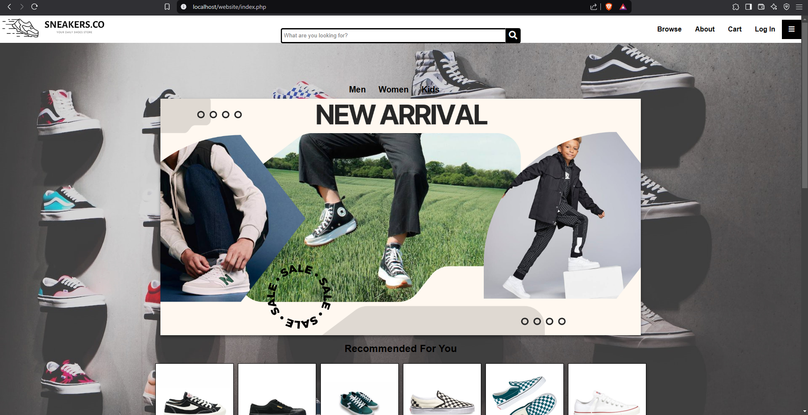

# SNEAKERS.CO Ecommerce Website

Project Overview: During my last semester for CSC264, my group needs to develop an eCommerce website, and we chose Sneakers.co—a website that sells a variety of shoes. Our goal is to create a simple, user-friendly platform where customers can browse, select, and purchase shoes easily. We'll include essential features like user login, a shopping cart, and secure checkout to ensure a smooth shopping experience. This project helps us apply what we’ve learned in web development and gain hands-on experience in building an online store.

Technologies Used:

Frontend: HTML, CSS, JavaScript

Backend: PHP

Database: MySQL

Development Tools: Visual Studio Code, phpMyAdmin

This project enhanced my web development skills, strengthened my database management expertise, and provided hands-on experience in building efficient digital solutions to improve operational workflows. Through this, I gained valuable insights into user experience design, system security, and backend development.

## Website Preview

- Homepage

